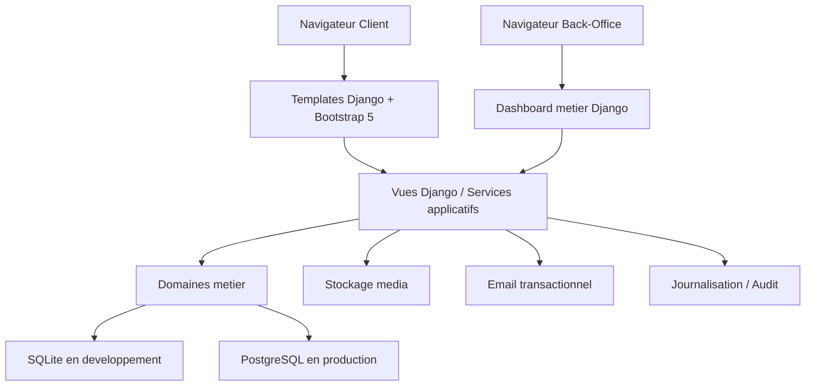
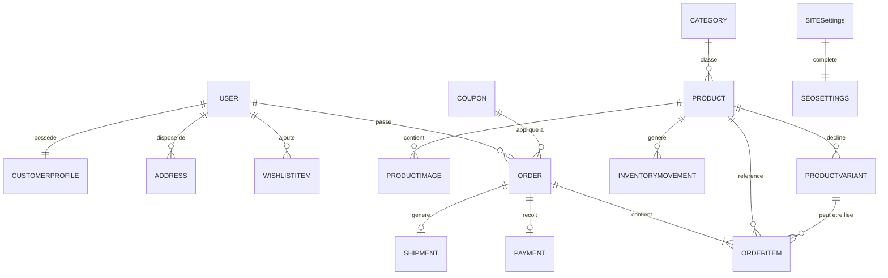
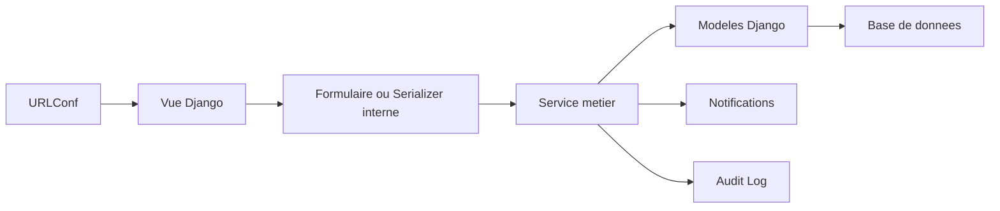

## 1. Architecture Generale



Architecture recommandee : monolithe modulaire Django. Cette approche est la plus adaptee pour un premier produit e-commerce professionnel car elle accelere le developpement, simplifie l'hebergement, garde une bonne separation des domaines et reste evolutive vers des services externes si necessaire.

## 2. Description Technologique
- Backend principal : Python 3.13+ et Django 6.x stable
- Interface client : Django Templates + Bootstrap 5 + Bootstrap Icons
- Interface d'administration metier : Django Templates + Bootstrap 5 + composants JS legers ciblant uniquement les interactions utiles
- Base de donnees dev : SQLite
- Base de donnees production : PostgreSQL via variables d'environnement
- Gestion des images : `ImageField` avec optimisation et conventions de nommage
- Taches differees (phase ulterieure) : Celery + Redis pour emails, notifications et maintenance
- Qualite logicielle : tests Django, linting Python, separation `settings` dev/prod, logs et checks de securite

## 3. Applications Django Cibles
| Application | Responsabilite |
|-------------|----------------|
| `core` | Parametres globaux du site, pages institutionnelles, contenu editable, SEO global |
| `accounts` | Utilisateur personnalise, profils, adresses, favoris, roles et permissions |
| `catalog` | Categories, produits, images, variantes, attributs, marques, recherche et merchandising |
| `cart` | Panier session/utilisateur, regles de quantite, coupons appliques, resume financier |
| `orders` | Commandes, lignes, statuts, suivi, livraison, taxes, paiements et historique |
| `promotions` | Coupons, remises, campagnes promotionnelles, produits soldes |
| `dashboard` | Back-office metier, KPIs, tableaux, gestion commerciale et vues internes |
| `notifications` | Emails transactionnels, notifications internes, modele de messages |
| `auditlog` | Journal des actions sensibles et traçabilite |
| `common` | Services partages, mixins, utilitaires, validateurs, enums |

## 4. Organisation Des Dossiers Recommandee
```text
Gestion-de-Vente/
|-- config/
|   |-- settings/
|   |   |-- __init__.py
|   |   |-- base.py
|   |   |-- dev.py
|   |   `-- prod.py
|   |-- urls.py
|   |-- asgi.py
|   `-- wsgi.py
|-- core/
|-- accounts/
|-- catalog/
|-- cart/
|-- orders/
|-- promotions/
|-- dashboard/
|-- notifications/
|-- auditlog/
|-- common/
|-- templates/
|   |-- client/
|   |-- dashboard/
|   `-- includes/
|-- static/
|   |-- css/
|   |-- js/
|   `-- images/
|-- media/
|-- tests/
|-- requirements/
|   |-- base.txt
|   |-- dev.txt
|   `-- prod.txt
|-- .env.example
|-- manage.py
`-- README.md
```

## 5. Definitions Des Routes
| Route | Usage |
|-------|-------|
| `/` | Accueil et contenus marketing |
| `/catalogue/` | Liste des produits avec recherche, filtres, tri et pagination |
| `/catalogue/categorie/<slug>/` | Catalogue filtre par categorie |
| `/produit/<slug>/` | Detail complet d'un produit |
| `/panier/` | Consultation et mise a jour du panier |
| `/commande/validation/` | Tunnel de validation de commande |
| `/commande/succes/` | Confirmation de commande |
| `/mon-compte/` | Tableau de bord client |
| `/mon-compte/commandes/` | Historique des commandes |
| `/mon-compte/favoris/` | Liste des produits favoris |
| `/auth/connexion/` | Connexion |
| `/auth/inscription/` | Inscription |
| `/auth/mot-de-passe-oublie/` | Reinitialisation du mot de passe |
| `/dashboard/` | Tableau de bord metier interne |
| `/dashboard/produits/` | Gestion des produits |
| `/dashboard/categories/` | Gestion des categories |
| `/dashboard/commandes/` | Gestion des commandes |
| `/dashboard/utilisateurs/` | Gestion des roles et comptes |
| `/dashboard/parametres/` | Personnalisation du site |

## 6. Modele Metier Et Relations
### 6.1 Vue D'Ensemble


### 6.2 Modeles Principaux
| Modele | Champs clefs | Relations |
|--------|--------------|-----------|
| `User` | email, nom, prenom, role, is_active | base d'authentification |
| `CustomerProfile` | telephone, date_naissance, marketing_opt_in | `OneToOne` avec `User` |
| `Address` | type, ligne_1, ville, code_postal, pays, is_default | `ForeignKey` vers `User` |
| `Category` | parent, name, slug, description, image, is_active, seo fields | auto-relation optionnelle |
| `Product` | category, name, slug, sku, description, price, old_price, stock_policy, is_active, is_featured, is_on_sale, weight, dimensions | `ForeignKey` vers `Category` |
| `ProductImage` | product, image, alt_text, sort_order, is_primary | `ForeignKey` vers `Product` |
| `ProductVariant` | product, name, sku, price_override, stock_quantity, attributes_json | `ForeignKey` vers `Product` |
| `Cart` | user/session_key, coupon, subtotal, shipping_total, tax_total, total | panier courant |
| `CartItem` | cart, product, variant, quantity, unit_price | `ForeignKey` vers `Cart` |
| `Order` | number, user, status, payment_status, shipping_status, subtotal, discount_total, shipping_total, tax_total, total, billing_snapshot, shipping_snapshot | `ForeignKey` vers `User` |
| `OrderItem` | order, product, variant, product_name, sku, quantity, unit_price, line_total | `ForeignKey` vers `Order` |
| `Payment` | order, method, amount, status, transaction_reference, paid_at | `OneToOne` ou `ForeignKey` selon strategie |
| `Shipment` | order, carrier, tracking_number, status, shipped_at, delivered_at, shipping_fee | `OneToOne` avec `Order` |
| `Coupon` | code, type, value, min_amount, starts_at, ends_at, usage_limit, is_active | utilise dans panier et commande |
| `SiteSettings` | site_name, logo, favicon, primary_color, secondary_color, address, phone, email, hours, socials, footer_text | singleton de configuration |
| `ActionLog` | actor, action, target_model, target_id, payload, created_at | audit interne |

### 6.3 Principes De Modelisation
- Conserver un instantane des prix, libelles et adresses au moment de la commande afin de proteger l'historique.
- Decoupler `payment_status`, `shipping_status` et `order status` pour gerer les cas reels sans ambiguite.
- Introduire les variantes en modele separe afin de supporter taille, couleur et stock fin par declinaison.
- Centraliser les contenus modifiables du site dans `core` pour eviter les changements de code inutiles.
- Utiliser des slugs, indexes et contraintes d'unicite sur les champs metier critiques.

## 7. Architecture Serveur


## 8. Exemples D'API Internes Et Contrats
Le projet peut fonctionner d'abord en rendu serveur. Les interactions asynchrones utiles seront exposees via des endpoints Django ciblés.

| Endpoint | Methode | Usage |
|----------|---------|-------|
| `/api/catalogue/recherche/` | `GET` | Recherche instantanee |
| `/api/panier/ajouter/` | `POST` | Ajout au panier |
| `/api/panier/article/<id>/` | `PATCH` | Mise a jour de quantite |
| `/api/panier/article/<id>/supprimer/` | `POST` | Suppression d'une ligne |
| `/api/dashboard/commandes/<id>/statut/` | `POST` | Changement rapide de statut |

```python
from typing import TypedDict


class CartSummaryResponse(TypedDict):
    items_count: int
    subtotal: str
    discount_total: str
    shipping_total: str
    tax_total: str
    total: str
```

## 9. Strategie D'Implementation
1. Stabiliser l'infrastructure Django et la configuration d'environnement.
2. Introduire l'app `accounts` et le modele utilisateur adapte.
3. Refondre `catalog` pour supporter SEO, galerie, variantes et stock professionnel.
4. Extraire le panier vers une app `cart`.
5. Renforcer `orders` avec snapshots, statuts et calculs complets.
6. Construire le dashboard metier.
7. Ajouter promotions, notifications, audit, optimisation et hardening production.

## 10. Parametres Production
- Variables d'environnement pour secret key, base PostgreSQL, emails et hote autorises
- `SecurityMiddleware`, cookies securises, HTTPS, HSTS, CSRF et sessions durcies
- Stockage statique et media configure pour la production
- Logs applicatifs et journaux d'erreur
- Commandes de sauvegarde et supervision basique
