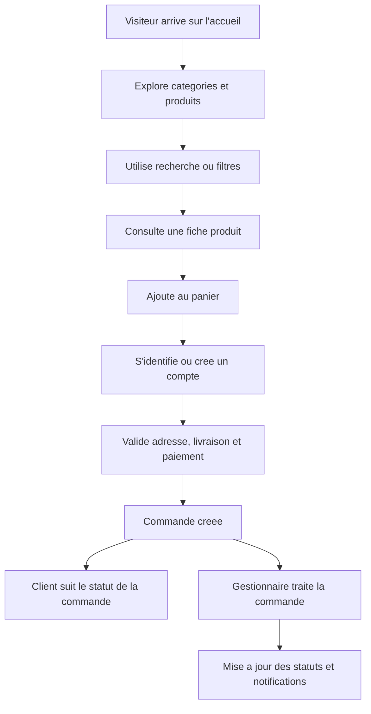

## 1. Vue D'Ensemble Du Produit
Boutique e-commerce moderne developpee avec Django pour une utilisation professionnelle, avec un site client complet et un back-office metier distinct de l'administration Django native.
- Le produit cible les visiteurs, clients, gestionnaires et administrateurs d'une boutique en ligne ayant besoin d'un parcours d'achat fluide, d'une gestion catalogue rigoureuse et d'un pilotage commercial centralise.
- La valeur metier est de disposer d'une base solide, maintenable et evolutive, exploitable d'abord avec SQLite en developpement puis PostgreSQL en production sans refonte structurelle.

## 2. Fonctionnalites Coeur

### 2.1 Roles Utilisateurs
| Role | Methode d'acces | Permissions coeur |
|------|------------------|-------------------|
| Visiteur | Sans inscription | Parcourir le catalogue, rechercher, filtrer, consulter les fiches produit |
| Client | Inscription par email | Passer commande, gerer son profil, consulter son historique, suivre ses commandes, gerer ses favoris |
| Gestionnaire | Cree par un administrateur | Gerer categories, produits, commandes, promotions, contenus et suivi commercial |
| Administrateur | Cree par superutilisateur | Acces complet au tableau de bord, aux parametres du site, aux utilisateurs, aux roles et aux journaux |

### 2.2 Modules Fonctionnels
1. **Vitrine client** : page d'accueil, banniere, produits recents, populaires, en promotion, categories mises en avant, pages institutionnelles.
2. **Catalogue** : liste des produits, filtres par categorie/prix/disponibilite, recherche instantanee, pagination, tri, detail produit, produits similaires et recommandes.
3. **Compte client** : inscription, connexion, reinitialisation du mot de passe, profil, adresses, favoris, historique et detail des commandes.
4. **Panier et commande** : panier en session ou lie au compte, modification des quantites, suppression, calculs automatiques, coupons, livraison, taxes et validation de commande.
5. **Gestion commerciale** : commandes, changements d'etat, suivi logistique, promotions, coupons, stock, alertes de rupture.
6. **Administration metier** : tableau de bord moderne, statistiques, gestion des utilisateurs, personnalisation visuelle du site, configuration des liens sociaux et du contenu marketing.
7. **Infrastructure et qualite** : SEO, emails automatiques, journal des actions, securite Django, sauvegardes, optimisation media et performances.

### 2.3 Detail Des Pages
| Nom de page | Module | Description fonctionnelle |
|-------------|--------|---------------------------|
| Accueil | Hero / slider | Met en avant la marque, les promotions et les categories principales |
| Accueil | Blocs produits | Affiche produits recents, populaires, vedettes et en promotion |
| Catalogue | Recherche et filtres | Recherche instantanee, filtres par categorie, prix, disponibilite, tri et pagination |
| Detail produit | Fiche produit | Affiche description, galerie d'images, variantes, stock, recommandations et ajout au panier |
| Panier | Gestion du panier | Met a jour quantites, supprime des lignes, applique coupon, recalcule les montants |
| Validation commande | Checkout | Collecte adresse, mode de livraison, recapitulatif, conditions et confirmation |
| Espace client | Tableau de bord client | Resume des commandes, informations de profil, adresses et favoris |
| Espace client | Historique commandes | Liste les commandes, leur statut et leur detail |
| Pages institutionnelles | A propos / contact / FAQ / CGV / confidentialite | Contenus gerables depuis l'administration |
| Dashboard admin | Vue d'ensemble | KPIs, chiffre d'affaires, commandes recentes, produits les plus vendus |
| Dashboard admin | Gestion catalogue | Cree, modifie, active ou desactive categories, produits, images, variantes et promotions |
| Dashboard admin | Gestion commandes | Consulte les commandes, filtre par statut, modifie facilement l'etat et suit les paiements |
| Dashboard admin | Parametres du site | Modifie logo, favicon, banniere, couleurs, contacts, reseaux sociaux, contenus de pages |

## 3. Processus Coeur
Les parcours principaux sont les suivants : le visiteur decouvre la boutique, recherche ou filtre des produits, consulte une fiche, ajoute des articles au panier, s'identifie ou cree un compte, valide sa commande, puis suit l'avancement depuis son espace client. Cote gestion, le gestionnaire administre le catalogue, controle le stock, traite les commandes et ajuste les contenus commerciaux depuis un dashboard dedie.

## 4. Conception De L'Interface
### 4.1 Style Visuel
- Couleurs principales configurables depuis l'administration, avec une palette par defaut premium et contrastes accessibles
- Boutons arrondis, etats hover nets, badges promotion et stock visibles
- Typographie moderne et lisible, avec hierarchie claire pour les prix, titres et appels a l'action
- Mise en page desktop-first avec grille Bootstrap 5, cartes produit coherentes et navigation sticky
- Icons Bootstrap Icons pour actions catalogue, panier, compte, reseaux sociaux et dashboard

### 4.2 Vue D'Ensemble Des Interfaces
| Nom de page | Module | Elements UI |
|-------------|--------|-------------|
| Accueil | Hero | Grande banniere, CTA, image marketing, indicateurs de confiance |
| Accueil | Produits en vedette | Cartes produits avec image, prix, remise, etat du stock |
| Catalogue | Barre d'outils | Recherche, filtres, tri, compteur de resultats |
| Detail produit | Galerie | Image principale, miniatures, variantes, informations stock |
| Panier | Tableau panier | Lignes modifiables, resume, code promo, total dynamique |
| Dashboard admin | KPIs | Cartes statistiques, tableau commandes recentes, graphiques synthese |
| Parametres site | Personnalisation | Formulaires clairs, apercus logo/banniere, champs reseaux sociaux |

### 4.3 Responsive
Approche desktop-first avec adaptation tablette et mobile, navigation compacte, formulaires empiles, galeries tactiles et tableaux transformes pour conserver un parcours d'achat fluide sur tous les ecrans.
